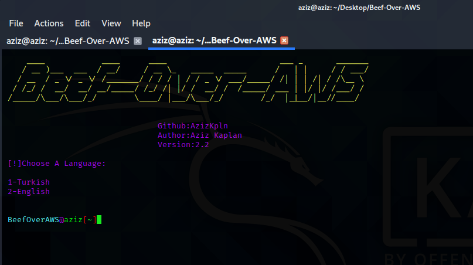

# Beef-External
* Version:2.4

# 

# What IS Beef-External?

```
With default installation, you use beef on your local system.
In order to be able to use it anonymously and securly you have to use a reverse proxy software.
Beef-External allows you to use 'Beef-XSS' cross the internet securly and anonymously.

```

# USAGE

> Please Watch The Video To Understand The Usage

* https://youtu.be/5WAz8vbQ8xw


# Note 0:
* Installation progress will take a while. Do not interrupt the progress. Especially, don't press to enter.

# Note 1:
* Use no root!
* git clone https://github.com/Magelan-Pentesting/Beef-External.git
* cd Beef-External
* chmod a+x install.sh beef-ex.sh kill_beef.sh config/config.sh
* ./install.sh
* 
# Version 2.4

* Works Without Errors


